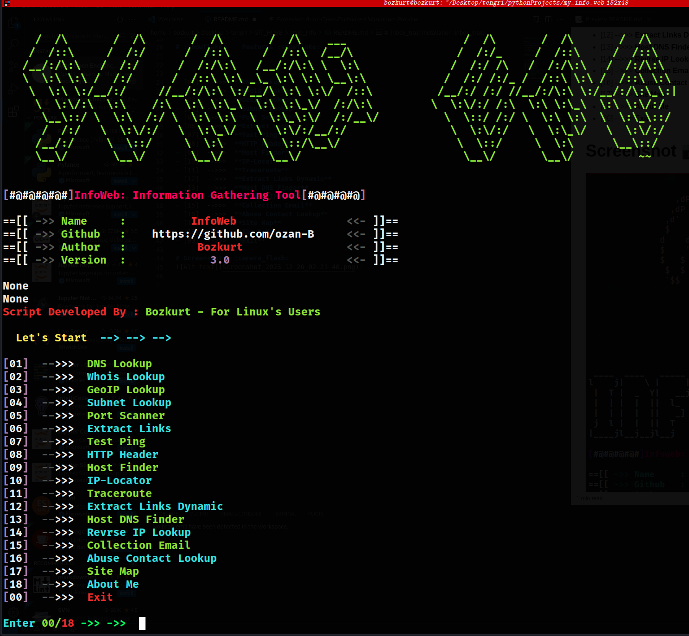

# Quest Web :link:	
__*Website Information Gathering Tool*__

*************

# :inbox_tray: Installation :inbox_tray:

    git clone https://github.com/ozan-B/Web_Info.git 

    cd infoweb Web_Info

    sudo python3 -m pip install -r requirements.txt

    python3 questweb_.py

****************
# :snowflake:	 Features :snowflake:	

- [01]  -->>>  **DNS Lookup**
- [02]  -->>>  **Whois Lookup**
- [03]  -->>>  **GeoIP Lookup**
- [04]  -->>>  **Subnet Lookup**
- [05]  -->>>  **Port Scanner**
- [06]  -->>>  **Extract Links**
- [07]  -->>>  **Test Ping**
- [08]  -->>>  **HTTP Header**
- [09]  -->>>  **Host Finder**
- [10]  -->>>  **IP-Locator**
- [11]  -->>>  **Traceroute**
- [12]  -->>>  **Extract Links Dynamic**
- [13]  -->>>  **Host DNS Finder**
- [14]  -->>>  **Revrse IP Lookup**
- [15]  -->>>  **Collection Email**
- [16]  -->>>  **Abuse Contact Lookup**
- [17]  -->>>  **Site Map**
- [18]  -->>>  **About Me**
- [00]  -->>>  **Exit**

# Screenshot   :camera_flash:

